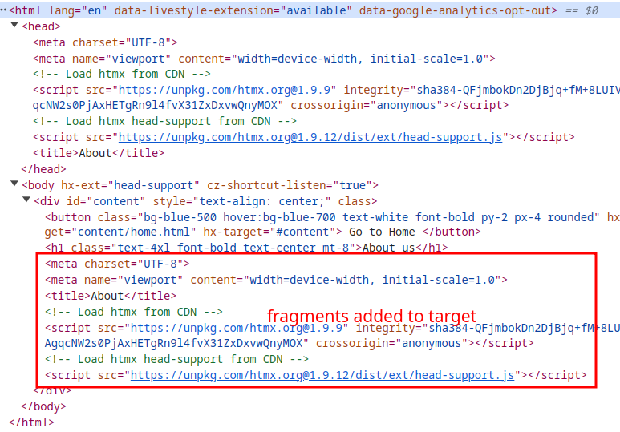

# Test project to demonstrate buggy behaviour of htmx head-support extension
This simple test pge demonstrates buggy behaviour descriped in this issue report https://github.com/bigskysoftware/htmx/issues/2575

# Instructions for observing current behaviour

1. open https://gebeer.github.io/htmx_head-support/
2. click on "Go to About" button
3. observe DOM in dev tools

The head-support extensions swaps contents of the head tag on each request. 

We can observe that also fragments of the head tag are appended into the defined target element.

